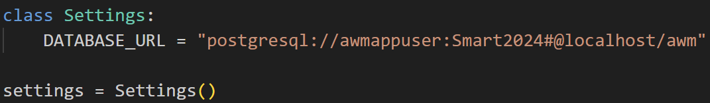

# AWM

## Execute the scripts to create schema

## Python FAST API

Update the Postgres connection string in config.py
```    

```

Navigate to the project directory
```
cd AWM/awm-api/user-management-api
```
Run this command
```
uvicorn app.main:app --reload
```
## React front end
Navigate to the project directory
```
cd AWM/awm-admin
```
Run this command
```
npm start
```